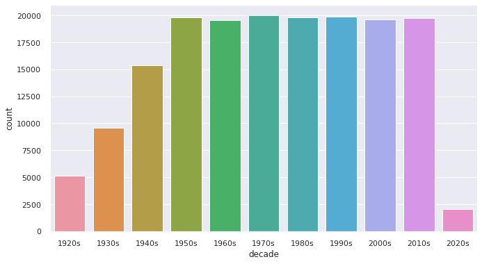

Система рекомендаций музыки пользователю. Цель: повышение заинтересованности пользователя путём автоматизации процесса выдачи рекомендованных песен.

Задачи:

1) анализ существующих методов рекомендации пользователю музыки;
2) разработка алгоритма рекомендации музыки;
3) оценка эффекта оптимизации. 
Датасет: данные со Spotify.

Целесообразность использования датасета для решения поставленной задачи: Данный датасет представляет из себя набор музыки, хранимой в Spotify, разделённый по различным критериям (исполнитель, год выпуска, жанр музыки).

Обработка датасета: Для достижения поставленной цели изначальный датасет был разбит на несколько других: разделённый по исполнителям, годам и жанрам.

Практическая значимость: Модель будет использоваться как часть будущего приложения для прослушивания музыки.
