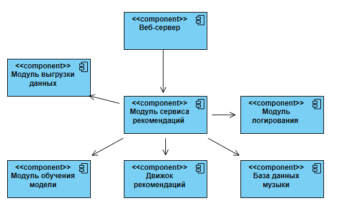

Система рекомендаций музыки пользователю. Цель: повышение заинтересованности пользователя путём автоматизации процесса выдачи рекомендованных песен.

Задачи:

1) анализ существующих методов рекомендации пользователю музыки;
2) разработка алгоритма рекомендации музыки;
3) оценка эффекта оптимизации. 
Датасет: данные со Spotify.

Целесообразность использования датасета для решения поставленной задачи: Данный датасет представляет из себя набор музыки, хранимой в Spotify, разделённый по различным критериям (исполнитель, год выпуска, жанр музыки).

Обработка датасета: Для достижения поставленной цели изначальный датасет был разбит на несколько других: разделённый по исполнителям, годам и жанрам.

Практическая значимость: Модель будет использоваться как часть будущего приложения для прослушивания музыки.

Далее приведена UML диаграмма работы компонентов сервиса.

На этой диаграмме компонентов показаны основные компоненты системы музыкальной рекомендации, включая движок рекомендаций, базу данных музыки, сервис рекомендаций и сервис журналирования. Связи между компонентами показаны стрелками, которые указывают на направление потока данных или вызова функций между компонентами.
Например, веб-сервер вызывает сервис рекомендаций для получения рекомендаций музыки. Сервис рекомендаций использует движок рекомендаций и базу данных музыки для генерации рекомендаций, а также сервис журналирования для записи логов. Внешние сервисы могут использоваться для получения дополнительной информации о музыке, такой как обложки альбомов или тексты песен.

Далее приведена диаграмма компонентов процесса работы системы рекомендации.

